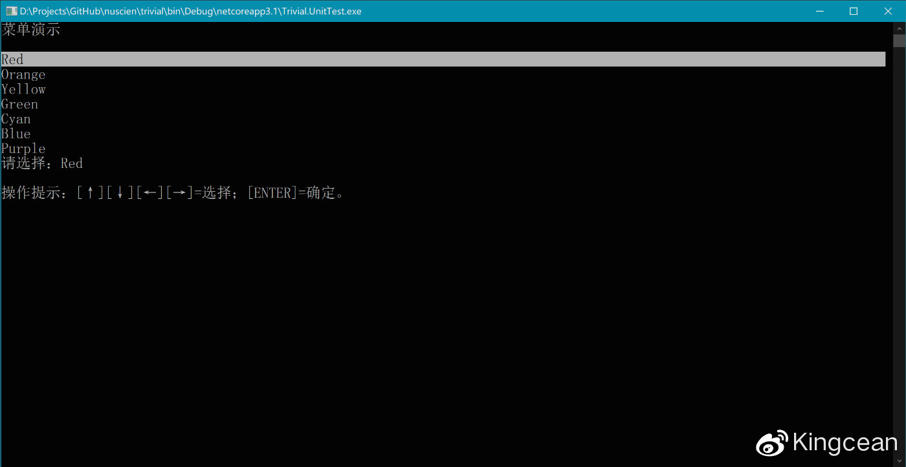
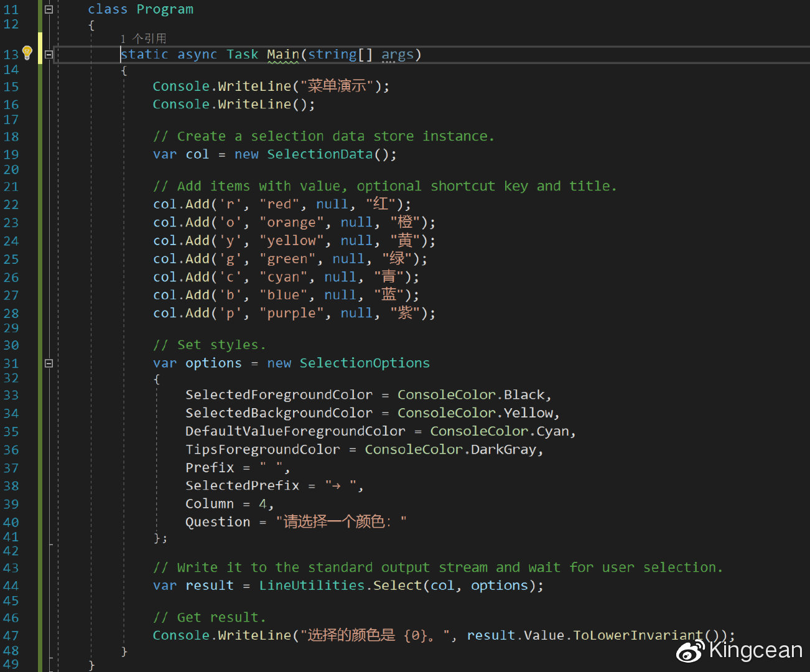
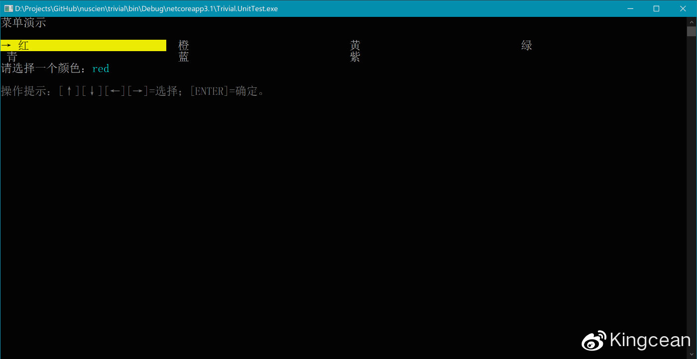
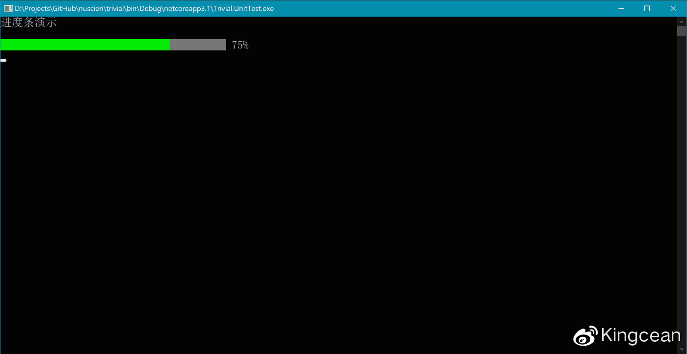

# 开发有趣的命令行应用

许多 .NET 开发都应该写过 Console 应用程序。通过 `System.Console.WriteLine(string)` 输出一些文本，夹杂着部分 `System.Console.ReadLine()` 去读取用户输入的内容，配合对前景（文本）和背景的颜色进行设置，一个整洁的 Console 应用程序就诞生了。

然而，我们并不想局限于此，不想 CLI 只是单调的文本输入输出。我们也见过许多 CLI 带有更丰富的界面，例如一个简单的通过键盘上下键按钮来选择的菜单。那么，如果我们也想实现类似效果，该如何进行呢？其实很简单，这里介绍一个基于 .NET Standard 2.0 的免费开源库（适用于 .NET 3.1、.NET Core 2.0、.NET Framework 4.6.1、Mono 5.4 或更高版本运行时）——`Trivial.Console`（本文使用 v3.6 为例），可通过 NuGet Gallery 获取。

https://www.nuget.org/packages/Trivial.Console

将该库添加到你的项目后，需要在你的代码中引入以下命名空间。

```csharp
using Trivial.Console;
```

本文将介绍其中的一些富交互命令行组件。

- 菜单
- 进度条
- 文本流
- 密码输入

## 菜单

我们有时会向用户提供一些选项，供用户选择之后继续进一步的操作或流程。传统的做法是，提示用户可以通过按下某个键盘按键，或输入某个关键词，来进行选择。例如，我们有一个程序，需要用户在红橙黄绿青蓝紫中选择一个颜色，我们很有提示用户可以通过输入 red、orange、yellow 等关键词来选择。但显然，这样的效果并不好。如果能提供一个界面，将选项全部列举出来，用户可以通过键盘上的上下左右以及回车键来进行选择，那种感觉明显好多了。

幸运的是，这并不复杂。

首先，我们需要用 `SelectionData` 类创建一个选择内容的对象，随后通过其 `AddRange(IEnumerable<string>)` 成员方法给它添加需要呈现的内容，如下。

```csharp
var col = new SelectionData();
col.AddRange(new[] { "Red", "Orange", "Yellow", "Green", "Cyan", "Blue", "Purple" });
```

然后，通过 `LineUtilities.Select(SelectionData, SelectionOptions`) 方法，可以把它输出到界面了。该方法的第2个参数为可选参数，故此可以不填。

```csharp
var result = LineUtilities.Select(col);
```

随后界面输出一个菜单选择器，并同步等待用户通过键盘进行选择。其选择结果，会通过该方法的返回值返回，此时可以通过读取其 `Value` 属性来获取用户选择的内容。

```csharp
Console.WriteLine("选择的颜色是 {0}。", result.Value.ToLowerInvariant());
```

按一下 F5 来看看效果。



通过短短的几行代码，我们已经初步实现可用的界面，用户可以通过键盘上的上下左右键以及回车键来直接选择。


不过，我们还可以做得更好。例如，我们还可以加入一些快捷键。试想一下，某些常用的选项，例如红色，可以通过按下 `R` 键进行选择，那样的效果更好。另外，我们可能希望我们所列举的个项中的“值”与显示在屏幕上的文本略有不同，因为界面呈现的文本通常需要更适合人类阅读，包括可能会包含本地化，而“值”则应该更适合电脑阅读，类似于代号，例如红色，我们希望在界面上输出“红”，而实际的“值”是 `red`。为此，我们需要修改上述代码，在初始化实例后面，将原先的批量添加菜单列表的方法，修改为如下方式，将各项逐个添加。

```csharp
col.Add('r', "red", null, "红");
col.Add('o', "orange", null, "橙");
col.Add('y', "yellow", null, "黄");
```

以上仅演示了前3项，后面的4项也同样如此。

另外，我们还可以修改该菜单的样式。方法很简单，只需创建一个 SelectionOptions 对象即可，该对象包含许多可以自定义的属性可以设置。最后，我们将该对象作为 `LineUtilities.Select(SelectionData, SelectionOptions)` 方法的第2个参数传入。以下是全部代码。



这里，我们定制：选中态的前景（文本）色、选中态的背景色、选中内容提示的前景（文本）色、底部提示的前景（文本）色、各项默认前缀、选中态的前缀、分列列数、提示文本。执行运行后，效果如下。



或许，你已经想到了，现实中添加各项，在很多情况下可能是遍历一个已有列表，该列表可能很长，在 `ConsoleOptions` 中也提供翻页功能，用户除上下左右键外，也可通过 Page Up 和 Page Down 键来实现快速翻页。另外，通过设置 `ManualQuestion` 属性来设置手动输入内容的提示，设置该值之后，当用户按下退格键时，将退出通过键盘方向键、翻页键、快捷键、回车键等方式进行菜单选择，而改为用户直接键入值的传统模式。

具体 `ConsoleOptions` 所含自定义项和其它方法，可以参考其注释文档。

##进度条

当我们的程序需要执行一个花费较长事件的任务时，如果屏幕上只是显示“请稍候……”字样，可能略显单薄，除非等待时间非常短。如果预期可能会达到 10 秒以上，那么最好还是给出一个进度条吧。


以上道理大家都懂，可是如何在命令行中输出一个进度条呢？同样很简单：调用 `LineUtilities.WriteLine(ProgressLineOptions.Sizes, ProgressLineOptions.Styles)` 方法即可，其中第2个参数为可选参数。

```csharp
var progress = LineUtilities.WriteLine(ProgressLineOptions.Sizes.Normal);
```

其中，`ProgressLineOptions.Sizes` 枚举包含以下值。

- `Normal` 常规宽度。
- `Short` 短。
- `Wide` 长。
- `Full` 几乎撑满整行。
- `None` 不显示进度条。

该方法会立即返回一个用于报告进度的控制实例，该实例实现了 `IProgress<double>` 接口，即后续只需调用 `Report(double)` 方法即可自动更新界面，直至任务完成，其取值范围为 0 到 1，当为 1 时即为完成，完成后不可继续修改，除非调用 `ResetStatus(double)` 方法重置状态。以下模拟了一个耗时任务，并按需更新进度条状态。

```csharp
for (var i = 0; i <= 20; i++)
{
  await Task.Delay(100); // Do something here.
  progress.Report(0.05 * i);
}
```

当然，该返回值还包含一些其它功能，如 `Fail()` 成员方法可设置进度条变为错误状态样式，具体可参阅 `ProgressLineResult` 类的注释文档。以上代码运行效果如下图所示。



同样，进度条也支持多种个性化项的定义，可通过创建 `ProgressLineOptions` 对象，来设定长度和各部分颜色，以及可以设定任务条的样式风格。随后可通过调用 `LineUtilities.WriteLine(ProgressLineOptions)` 方法来输出。更多细节请参阅 `ProgressLineOptions` 类的注释文档。

## 文本流

有时候，我们需要对输出的文本进行更高级的控制，例如，我们可以将文本和对应的颜色存入缓冲区，并在何时需要的时候，将缓冲区中的内容批量输出至界面，或进行清除。


开始之前，需要先创建一个用于管理和代理命令行输入输出的实例，即初始化 `Line` 类的一个实例，建议将该实例作为单例。

```csharp
var line = new Line();
```

随后，可以像使用 `Console` 类一样，去调用该实例里的成员方法。不过，这些成员方法通常还会包含多项重载，用于在输出文本时同时设定此次操作所需的前景（文本）和背景的颜色，输出后这些颜色的设定将会自动还原。除此之外，还可以通过 `Backspace(int)` 方法，删除之前输出的指定数量的字符。

```csharp
// Write something.
line.Write("Loading {0}......", "something");

// Remove some characters and append other string with color.
line.Backspace(3);
line.Write(ConsoleColor.Green, "\tDone!");

// And you can append other string following above in the same line and in the default color.
line.Write(" This is only for test.");
```

通过 `End()` 成员方法可以结束这一行，即换行，并开始新的一行。但请注意，反复调用该方法，并不会增加多个空白行，因为其仅表示当前行的内容输出完毕，因此会自动过滤无内容的新行。

```csharp
// Add terminator.
line.End();

// You cannot add further terminator if there is no any string output.
line.End();

// So following will be in a new line.
line.Write("Next line. ");
```

进入新的一行后，所有状态也会恢复如初。

以上是默认输出模式，即自动输出至终端。有时，调用 `Write(string)` 等成员方法时，希望不立即输出至终端，可以通过设置成员属性 `AutoFlush` 为 `false` 的方式，禁用自动输出功能来实现。待需要批量输出时，再调用 `Flush()` 成员方法来执行。

```csharp
// We can turn off the auto flush so that all strings write later will be in an output queue.
line.AutoFlush = false;
line.Write(ConsoleColor.Red, ConsoleColor.Yellow, "Red foreground and yellow background");
line.End();
line.Write("This will not be output immediately, neither.");

// Now let's write them.
line.Flush();

// Following will not output until we call Flush member method or set AutoFlush property as true.
line.Write(" Hello?");
line.AutoFlush = true;
line.End();
```
如此，文本的输出更具有可控性。

## 密码输入

用时，我们需要用户输入一些密码，但在输入密码时，因为不想让将所输入的密码原文现实在界面上，因此会通过 `Console.ReadKey()` 方法将密码内容逐一读入。但其实，这很难应对复杂场景，例如以下情况。

- 用户输入错误，希望通过退格键删除前一项内容，甚至希望一键清除后重新输入。
- 有时希望呈现替代字符，如 `*`（星号）。
- 输入的内容希望有相对更为安全的方式保存。

尤其是当以上场景交织在一起时，更为复杂。

借助上一节介绍的 Line 类，其还包含以下一组重载方法，可以轻松实现密码读取功能，并返回 SecureString 类型。

- `ReadPassword()`
- `ReadPassword(char replaceChar)`
- `ReadPassword(char? replaceChar, ConsoleColor? foregroundColor)`

下方为一个简单示例。

```csharp
line.Write("Type password: ");
var password = line.ReadPassword('*', ConsoleColor.Yellow);
line.WriteLine();
```

当用户输入错误时，可按退格键往前删除一个字符；也可按 Ctrl + 退格键，或按 Delete 键，一次删除所有输入的字符。如果设置了替代字符，该替代字符也会跟随用户的删除操作而删除。

以下示例演示了将 `SecureString` 类型输出到终端。

```csharp
line.Write("Your password is ");
line.Write(ConsoleColor.Magenta, password);
line.WriteLine('.');
```

当然，现实中不太会有这一类操作。如果需要将 `SecureString` 转为 `String` 使用，可以借助 Trivial 库里的 `Trivial.Security` 命名空间下的 `SecureStringExtensions.ToUnsecureString(SecureString)` 扩展方法来实现，或自行封装以下方法。

```csharp
static string ToUnsecureString(SecureString value)
{
  var unmanagedString = IntPtr.Zero;
  try
  {
    unmanagedString = Marshal.SecureStringToGlobalAllocUnicode(value);
    return Marshal.PtrToStringUni(unmanagedString);
  }
  finally
  {
    Marshal.ZeroFreeGlobalAllocUnicode(unmanagedString);
  }
}
```

怎么样？有需要或有兴趣的，快来试一试吧。​​​​

---

Kingcean Tuan (@kingcean)

Apr 8th, 2020 AD. 

Keywords:
cli; dotnet.

(CC) Kingcean Tuan, 2020.
