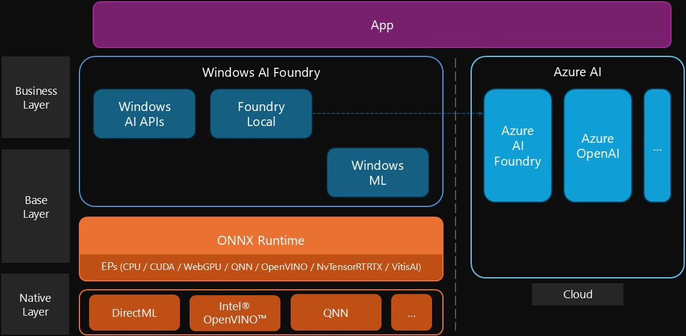
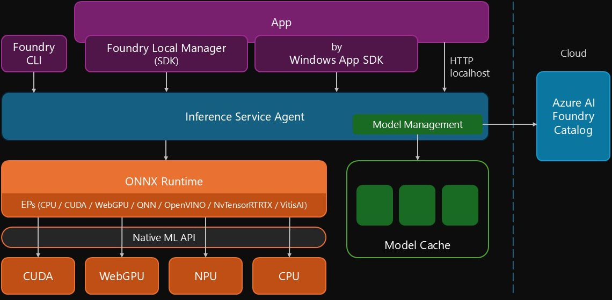
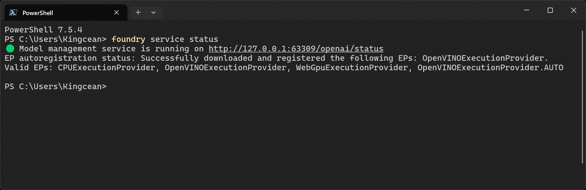
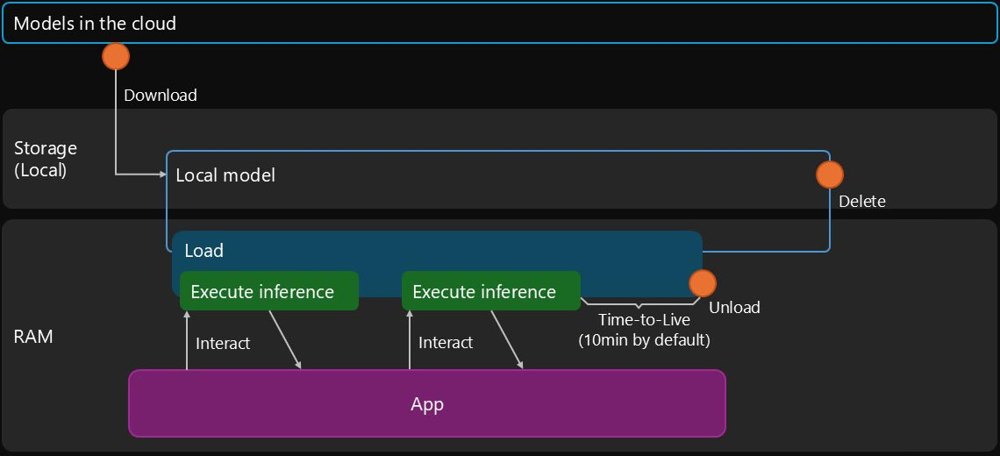

Foundry Local is a local AI service with language model accessing and management capabilities. It exports APIs to app for business usages.

## Intro

Currently, AI and its capabilities driven by large language models as the core interaction paradigm are shining brightly in the world. However, it must be acknowledged that due to limitations such as computational resources, model scale, and business integration, all of this is still in its early stages. Yet, people continue to explore in various directions, occasionally achieving breakthroughs.

Among these explorations, the application of smaller local models and their hybrid forms is one of the paths forward, aiming to address issues such as latency, server and bandwidth costs, and privacy concerns. Foundry Local is one such standardized framework designed to provide a simpler and more unified access method.

### In Preview

Foundry Local supports mulitple platforms and programming languates.

Currently (Oct, 2025), It is in PREVIEW (latest version is 0.8.94). Features, approaches, and processes can change or have limited capabilities, before General Availability.

### Functions

It is an AI service run on local machine to enable the functionalities powered by language models.

- Chat
- Generate text
- Summary text
- Format text and sentiment
- Translate
- Grammer check
- Others

### Relationship

Microsoft has more than one AI-related services, such as ONNX. What are their relationships and differences?



### 分发和组成

Foundry Local runs on Windows and macOS.

- Windows

   ```bash
   winget install Microsoft.FoundryLocal
   ```

- macOS

   ```bash
   brew tap microsoft/foundrylocal
   brew install foundrylocal
   ```

The Windows app is deployed by Package mode with following manifest.

| Key | Value |
| ---------- | ------------------- |
| Package ID | `Microsoft.FoundryLocal` |
| Publisher | `8wekyb3d8bbwe`（微软） |
| Permissions | `runFullTrust` |

Its main execution appications are following.

| 程序名 | 说明 |
| ---------- | -------------------- |
| `foundry.exe` | CLI |
| `Inference.Service.Agent.exe` | Background host |

## 架构



## APIs

### HTTP localhost &amp; CLI

```bash
foundry service status
```



> 🟢 Model management service is running on http://127.0.0.1:63309/openai/status

### SDK

- C# - [Microsoft.AI.Foundry.Local](https://www.nuget.org/packages/Microsoft.AI.Foundry.Local)

   ```bash
   dotnet add package Microsoft.AI.Foundry.Local
   ```

- JavaScript (Node.js) - [foundry-local-sdk](https://www.npmjs.com/package/foundry-local-sdk)

   ```bash
   npm install foundry-local-sdk
   ```

- Python - [foundry-local-sdk](https://pypi.org/project/foundry-local-sdk/)

   ```bash
   pip install foundry-local-sdk
   ```

- Rust

   ```toml
   [dependencies]
   foundry-local-sdk = "0.1"
   ```

## Models management

### Local cache

```text
%USERPROFILE%\.foundry\cache\models
```

```text
GET /openai/models
```

```bash
foundry cache list
```

### Available in cloud

```text
GET /foundry/list
```

```bash
foundry model list
```

Additional, a backup is saved in the `foundry.modelinfo.json` file in the cache directory.

### Download

```bash
foundry model download <model>
```

P.S.: `<model>` is the model unique identifier.

You can access this info by HTTP localhost (`POST /openai/download`) on Endpoint, or by the related functions in SDK.



### Remove

```bash
foundry cache remove <model>
```

## Chat

### REST


```text
POST /v1/chat/completions
```

### SDK


### AI 工具包


### CLI 交互


```bash
foundry model run <model>
```


<!-- End -->

## References

> This article is for technical sharing and for exchange and learning purposes only. Over time, some of the content may become outdated.
>
> The Foundry Local, Azure, ONNX, Windows, and VS Code mentioned in the article are products or services of Microsoft, and the copyright belongs to Microsoft. Other products and services mentioned are copyrighted by their respective companies or organizations.

### Resources

- [Foundry Local](https://learn.microsoft.com/en-us/azure/ai-foundry/foundry-local/)
- [ONNX](https://onnxruntime.ai/)
- [AI Dev Gallery](https://apps.microsoft.com/detail/9N9PN1MM3BD5)
