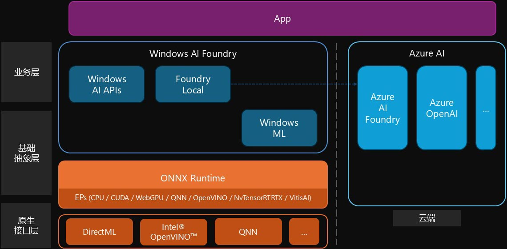
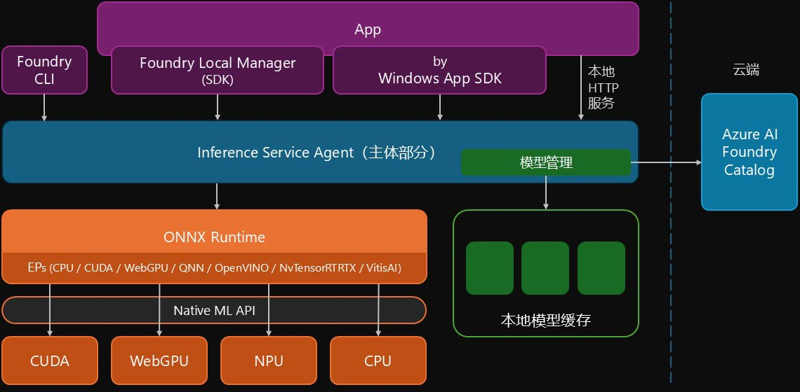
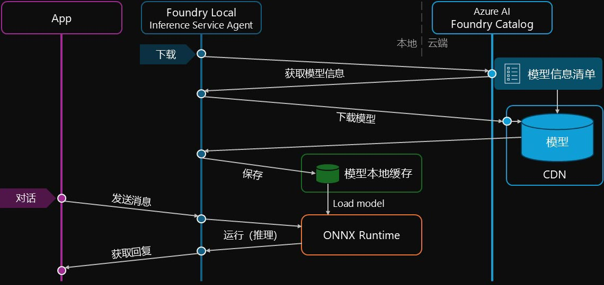
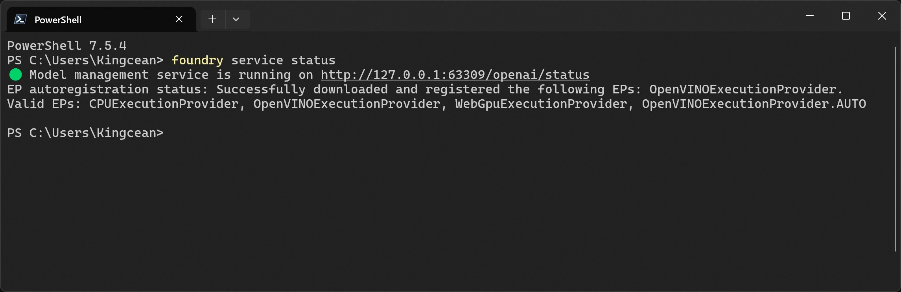
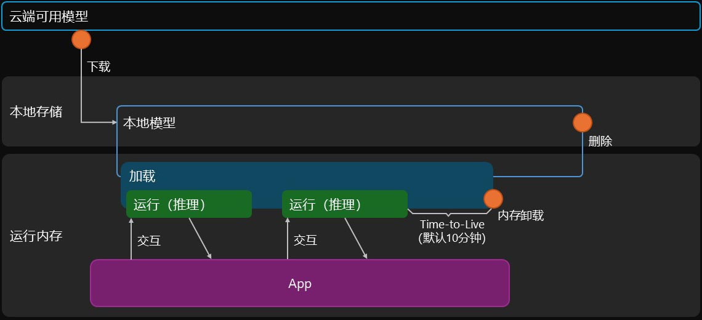

Foundry Local 是一套部署于本地的 AI 服务，包含语言模型的管理和访问，提供 API 以供 app 使用。

## 介绍

目前 AI 及其驱动的以大语言模型为核心的交互形态与能力体现，正在这个世界大放异彩，但不得不说，受计算资源、模型规模、业务集成等限制，这一切直至现今还是起步阶段，但人们仍然一直在各方各面向前探索，时有突破。其中，本地较小模型及其混合形式的应用，也是众多探索前行方向中的一个，以解决诸如时延、服务器和带宽成本、隐私等方面的问题。Foundry Local 便是其中一个标准化框架，用于提供更为简单和统一的接入方式。

### 预览状态

Foundry Local 支持多语言多平台。

目前（2025年10月）还处于预览状态（当下最新为 v0.8.94），待后续正式版发布时，可能部分情形会与本文描述不一致。

### 功能

本地部署的一套 AI 服务，支撑一系列语言模型相关的能力。

- 对话
- 文本内容生成
- 总结和内容提取
- 内容风格调整
- 翻译
- 语法检查
- 其它语言模型能力

### 关系矩阵

微软有多套 AI 相关的服务，例如 ONNX，那么它们之间的关系和区别有些什么呢？



- __DirectML__

  一套偏底层的抽象接口，调用 CPU、GPU、NPU 或其它硬件加速器实现 AI 相关能力，类似于 Direct3D 之于 GPU 图形相关能力支持。

- __ONNX Runtime__

  一套 AI 引擎，有时简称 ort，可用于将生成式 AI 和大语言模型集成至上层应用，包括训练和推理，且支持多种不同的编程语言。
  
  其底层支持根据需要配置成不同的原生 ML API 实现层，这些实现被称为 EP（执行提供程序 / execution provider）。例如，在 Windows 上其底层可以配置为基于 DirectML。其也包含适用于浏览器环境的 ONNX Runtime Web（底层是 WebNN）和适用于移动设备的 ONNX Runtime Mobile 等版本。

- __Olive__

  模型优化套装，可生成 ONNX 模型格式文件（.onnx），适用于继续给 ONNX Runtime 使用。

- __ML.NET__

  面向 .NET 的 AI 底层框架，提供一些基础能力，可与 ONNX 等搭配使用。

- __Azure AI__

  微软公有云上的 AI 产品集合，包括 Azure OpenAI、Azure AI Content Safety、Azure AI Foundry 等。其中 Azure AI Foundry 用于在云端弹性部署管理自己 LLM 和其它生成式 AI Copilot，包括模型、Agent 和工具链。

- __Foundry Local__

  在本地设备运行和管理 AI 语言模型，并提供 API 供 app 使用。其底层式 ONNX Runtime。

- __Windows AI APIs__

  一套集成在 WinRT 的 AI 相关 API，包含了当前 Windows 内置和支持使用的 AI 能力。

所以，Foundry Local 是 Windows 上本地 AI 解决方案，主要适用于包括对话、文本生成、翻译等语言模型相关场景。其与 Windows AI APIs 有部分场景类似，但也有以下区别；同时，这二者及其它一些工具，统称为 Windows AI 工场（Windows AI Foundry）。

- __Windows AI APIs__ 基于当前 Windows 打算提供（例如随预装或系统更新而来）的 AI 相关业务，而对外通过 Windows App SDK 提供相关访问能力；
- __Foundry Local__ 将支持的能力本身进行包装提供，同时也提供配套的模型管理，也就是说其自定义能力会相对更丰富一些，其可通过 Windows App SDK、Foundry Local Manager（即 SDK）或本地 HTTP 服务等方式访问。

也就是说，相关 AI 能力的接入，除了云端以外，还有本地，且两者可以按需混合使用。而在本地，一种是直接使用已内置好的 Windows AI APIs，其次是使用在一定层度上经过托管和包装的 Foundry Local，再次是可以利用 ONNX Runtime 直接使用自行部署管理的模型，当然，最后还有 DirectML 或来自其它厂商（如英特尔的 Intel® OpenVINO™）等更底层的 API 来支撑其它场景。

### 分发和组成

Foundry Local 支持在 Windows 和 macOS 上运行。

- 在 Windows 上，其随 Windows 系统所附，或随其它 app 分发，也可通过 winget 直接安装，支持 x64 和 arm64。

   ```bash
   winget install Microsoft.FoundryLocal
   ```

- 在 macOS 上，可在终端执行以下命令。

   ```bash
   brew tap microsoft/foundrylocal
   brew install foundrylocal
   ```

其中，Windows 版经 Package 封装，

| 项 | 值 |
| ---------- | ------------------- |
| 包名 | `Microsoft.FoundryLocal` |
| 发布者 | `8wekyb3d8bbwe`（微软） |
| 权限 | `runFullTrust` |

其内主要的应用程序如下。

| 程序名 | 说明 |
| ---------- | -------------------- |
| `foundry.exe` | CLI |
| `Inference.Service.Agent.exe` | 本体 · 后台服务 |

## 架构



### 模块和依赖

Foundry Local 的核心是 Inference Service Agent（即 `Inference.Service.Agent.exe` 程序），以后台进程形式运行，它包括了模型的管理和执行等核心能力。模型存储于本地，在执行时，其底层是依托 ONNX Runtime，并经由具体 EP 运行于适当的硬件加速器（如 CPU、GPU 或 NPU）中。

Foundry CLI（即 `foundry.exe` 程序）可与之进行交互，并管理其状态。该程序已注册至操作系统环境变量中，即可直接在命令行中运行，无需事先指定路径。

上层应用可通过两者访问 Foundry Local 的 AI 具体能力，及控制其服务状态。

### 运行流程



Foundry Local 所使用的语言模型均存储于本地，且支持动态管理。具体来说，在云端，Azure AI Foundry 注册表管理着所有可用模型，Foundry Local 可发起下载指令，该指令会先执行查询操作，以获得包括模型名称、版本、类型和配置信息等在内的信息清单，以及一个用于下载的 CDN 地址，随后会执行对模型文件的下载，保存于本地存储空间中指定的缓存目录中。

缓存中的模型会根据需要，被加载与内存中，当诸如对话或其它类型的 AI 请求从 App 发来时，Foundry Local 便会调用 ONNX Runtime 运行指定模型的推理，并返回结果。

## 接口形式

Foundry Local 运行于本地，支持本地 HTTP 服务和命名管道进行访问；并提供 CLI，其内部也是基于上述两种方式与核心部分（Inference Service Agent）进行通信所实现；此外，还有多种语言的 SDK，供上层访问，其内部基于上述诸方式搭配实现。

### 本地服务和 CLI

Foundry Local 开放本地 HTTP 服务（即 `http://localhost` + 特定端口）供上层 app 访问，以集成相关 AI 能力。

目前，其本地 HTTP 服务所绑定的端口是随机的，每次启动时并不一定相同，且没有较为直观简洁的公开编程接口获得，因此，可以通过以下命令访问。

```bash
foundry service status
```

其会在控制台上输出具体的状态地址，其中包括 `localhost` 上的端口号，可以截取该信息并构成 Endpoint 暂存于内存中，以便后续使用。如下所示，对应的 Endpoint 即 `http://localhost:63309`。



> 🟢 Model management service is running on http://127.0.0.1:63309/openai/status

访问该地址（即 `GET` 请求），也可以看到一些最基本的状态信息，是个 JSON 格式返回的数据，其中包括 `endpoint` 字段，是个字符串数组，内含上述 Endpoint 信息。Foundry Local 对外提供的服务，基本都以此 Host 为基础的 Web API 形式提供。

### SDK

实际上，这些访问能力也封装在 SDK 中，名为 Foundry Local Manager 或 foundry-local-sdk，支持多种语言。

- __C#__ - [Microsoft.AI.Foundry.Local](https://www.nuget.org/packages/Microsoft.AI.Foundry.Local)

   ```bash
   dotnet add package Microsoft.AI.Foundry.Local
   ```

- __JavaScript__ (Node.js) - [foundry-local-sdk](https://www.npmjs.com/package/foundry-local-sdk)

   ```bash
   npm install foundry-local-sdk
   ```

- __Python__ - [foundry-local-sdk](https://pypi.org/project/foundry-local-sdk/)

   ```bash
   pip install foundry-local-sdk
   ```

- __Rust__

   ```toml
   [dependencies]
   foundry-local-sdk = "0.1"
   ```

## 模型管理

Foundry Local 提供能力可以遍历位于云端的可用语言模型（即 Foundry Local 模型），但这些模型并不能被直接使用，需要被实现加载到本地。因此，其还具备本地模型的管理能力，包括下载、存储、使用和删除。

### 本地模型

所有被下载缓存至本地的模型，默认均存储于以下路径中。

```text
%USERPROFILE%\.foundry\cache\models
```

该目录之下存放有各模型，可能有一层或多层文件夹，其中一层目录以模型标识符命名。模型通常以 ONNX 模型格式文件封装，主要包括以下文件，不同模型具体情况可能会不一样。

- 模型主体：`.onnx` 文件和 `.onnx.data` 文件，以及可能存在的由模型构建器生成的配置参考 `genai_config.json` 文件。
- 基本信息：`inference_model.json`。
- 分词器相关配置：`tokenizer.json` 文件和 `tokenizer_config.json` 文件，以及可能存在的 `special_tokens_map.json` 文件。
- 词汇表文件：`merges.txt` 文件，有的可能是 `vocab.txt` 或 `vocab.json` 文件，有的模型还会包含额外补充的 `added_tokens.json` 文件。
- 其它配套文件。

通过 Endpoint 中以下 Web API 可以拉取到所有以下载的模型，返回的是一个字符串数组，每个元素都是对应模型的唯一标识符。

```text
GET /openai/models
```

或使用 SDK 也可获取。除此之外，也可通过以下 CLI 命令获取。

```bash
foundry cache list
```

### 云端可用模型

受支持的所有模型均位于云端，索引于 Azure AI Foundry 注册表（Azure AI Foundry Catalog）中，通过 Endpoint 中以下 Web API 可以拉取可用列表。

```text
GET /foundry/list
```

其返回的是一个 JSON 数组，列举了可下载模型信息。每个模型信息中包含了众多字段，以下几个是最重要的。

- `name` _字符串_：模型的唯一标识符（Model ID）。
- `displayName` _字符串_：显示名称。
- `alias` _字符串_：模型简称（Alias）。
- `version` _字符串_：模型的版本号。
- `uri` _字符串_：模型在 Azure AI Foundry 注册表中的资源地址。
- `publisher` _字符串_：发布者名称。
- `task` _字符串_：模型功能类型。以下为常见值。
  - `"chat-completion"` 对话
  - `"text-generation"` 文本生成
  - `"automatic speech recognition"` 语音识别（ASR）
- `supportsToolCalling` _布尔值_：是否支持工具调用。
- `runtime` _对象_：包括以下字段。
  - `deviceType` _字符串_：适配的硬件加速器类型，常见值包括 `"CPU"`、`"GPU"`、`"NPU"`。
  - `executionProvider` _字符串_：表示 EP，以下为常见值。
    - `"CPUExecutionProvider"` - CPU
    - `"CUDAExecutionProvider"` - NVIDIA® CUDA® GPU
    - `"WebGpuExecutionProvider"` - WebGPU
    - `"QNNExecutionProvider"` - 高通神经网络运算
    - `"OpenVINOExecutionProvider"` - Intel® OpenVINO™
    - `"NvTensorRTRTXExecutionProvider"`- NVIDIA® TensorRT™
    - `"VitisAIExecutionProvider"` - AMD Vitis™ AI
- `license` _字符串_：许可证。

除此之外，还有 `modelType` 模型格式、`promptTemplate` Prompt 模板、`fileSizeMb` 文件大小等其它字段。

以上信息也可以通过 SDK 相关函数获取。除此之外，也可通过 CLI 以下命令获取，不过其返回的内容所默认展示字段有所删选。

```bash
foundry model list
```

另外，这些信息也会有一个副本存储于前述缓存目录下的 `foundry.modelinfo.json` 文件中。

### 下载

可以通过以下命令，触发云端模型的下载，该模型会自动下载到缓存目录中，以备后续使用。

```bash
foundry model download <model>
```

其中，`<model>` 为对应的模型的唯一标识符。（下同）

也可以通过本地 HTTP 服务（`POST /openai/download`）或 SDK 触发模型的下载。

下载操作本身，是 Foundry Local 将模型的唯一标识符信息发送至 Azure AI Foundry 注册表，以获取具体的模型相关信息，在确定本地缓存无对应模型存在的前提下，根据云端返回的信息执行下载，耗时可能较长。

常见的模型包括微软的 Phi Silica 系列，以及阿里云通义 Qwen 和 DeepSeek 等。

下载完成后，模型即处于可用状态。



为了节约内存，模型会按需加载，也可手动预载。经过一段时间（TTL，默认为10分钟）没有使用后，会自动从内存中卸载。

### 删除

模型普遍占用空间不少，当需要释放存储空间时，可以通过 CLI 删除不再需要的模型，其会从缓存目录中将相关文件删除。删除之后，后续还可在需要时重新下载安装。

```bash
foundry cache remove <model>
```

## 对话式 AI

Foundry Local 完全兼容 OpenAI 的 REST API，也就是说，只需将 Endpoint 路径进行修改，就能如同以往常见的方式一样进行访问。

不过需要注意，由于端口不恒定，需在使用前确定最新 Endpoint。

### REST

对于直接通过 Web API 请求的使用，只需发送 HTTP 请求至以下地址，并采用和 OpenAI 的对话 completion 相同的输入构造和输出解析，即可完成对话式 AI 的交互。

```text
POST /v1/chat/completions
```

### SDK

使用 OpenAI 现有 SDK，将路径配置为 Endpoint 下 `/v1/chat/completions`，身份验证信息留空，即可访问。

### AI 工具包

在 VS Code 等 IDE 或其它可配置自定义 AI 模型的工具中，可添加以 Endpint 下 `/v1/chat/completions` 为接入点 URL，并配置缓存中已有的模型，身份验证标头字段留空，即可连接。

### CLI 交互

Foundry Local CLI 也内置了基于命令行的交互方式，通过以下命令会触发。

```bash
foundry model run <model>
```

如果指定的模型不存在，则会自动先执行下载安装，在运行并提供相关终端交互。

除此之外，还可以从 Microsoft Store 中下载安装 AI Dev Gallery（目前也为预览版）app 来体验。

<!-- End -->

## 参考

> 本文为技术分享，仅供交流学习之用。随着时间推移，可能会出现其中部分内容不再适用。
>
> 文中所提及 Foundry Local、Azure、ONNX、Windows、VS Code 为微软旗下产品或服务，版权归微软公司所有；其它各产品和服务，版权归其各自公司或组织所有。

### 相关链接

- [Foundry Local 官网](https://learn.microsoft.com/zh-cn/azure/ai-foundry/foundry-local/)
- [ONNX 简体中文官网](https://onnx.org.cn/)
- [AI Dev Gallery](https://apps.microsoft.com/detail/9N9PN1MM3BD5)
