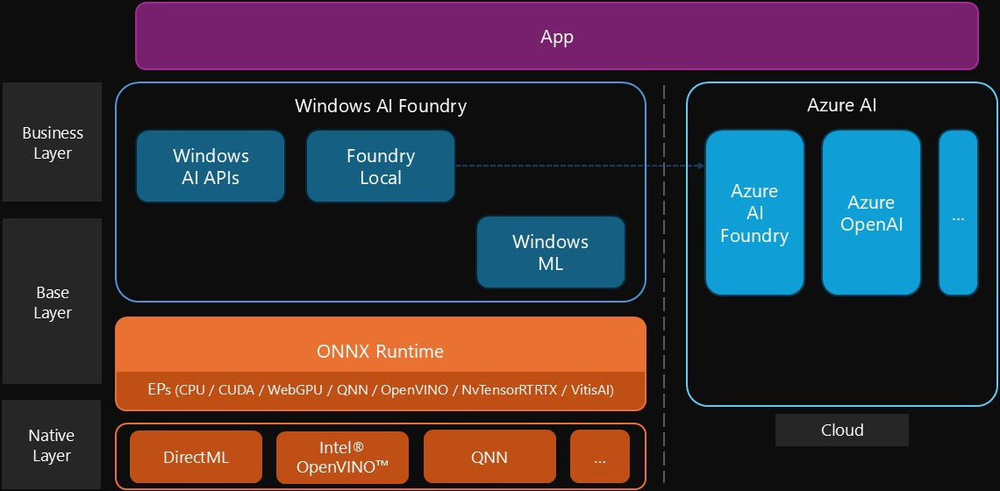

Foundry Local is a local AI service with language model accessing and management capabilities. It exports APIs to app for business usages.

## Intro

Currently, AI and its capabilities driven by large language models as the core interaction paradigm are shining brightly in the world. However, it must be acknowledged that due to limitations such as computational resources, model scale, and business integration, all of this is still in its early stages. Yet, people continue to explore in various directions, occasionally achieving breakthroughs.

Among these explorations, the application of smaller local models and their hybrid forms is one of the paths forward, aiming to address issues such as latency, server and bandwidth costs, and privacy concerns. Foundry Local is one such standardized framework designed to provide a simpler and more unified access method.

### In Preview

Foundry Local supports mulitple platforms and programming languates.

Currently (Oct, 2025) it is in PREVIEW (latest version is 0.8.94). Features, approaches, and processes can change or have limited capabilities, before General Availability (GA).

### Functions

It is an AI service run on local machine to enable the functionalities powered by language models.

- Chat
- Generate text
- Summary text
- Format text and sentiment
- Translate
- Grammer check
- Others

### Relationship

Microsoft has more than one AI-related services, such as ONNX. What are their relationships and differences?



- __DirectML__

  A set of low-level abstract interfaces that call CPUs, GPUs, NPUs, or other hardware accelerators to implement AI-related capabilities, similar to Direct3D's support for GPU graphics-related capabilities.

- __ONNX Runtime__

  An AI engine, sometimes referred to simply as ort, can be used to integrate generative AI and large language models into higher-level applications, including training and inference, and support for many different programming languages.
  
  The underlying supports configuring different layers of native ML API implementations as needed, known as EPs (execution providers). For example, on Windows, its underlying can be configured to be based on DirectML. It also includes versions such as ONNX Runtime Web for browsers (underlying WebNN) and ONNX Runtime Mobile for mobile devices.

- __Olive__

  The model optimization suite generates ONNX model format files (.onnx) for continued use by the ONNX Runtime.

- __ML.NET__

  The underlying framework for .NET AI provides some foundational capabilities that can be used with ONNX and more.

- __Azure AI__

  A collection of AI products on Microsoft's public cloud, including Azure OpenAI, Azure AI Content Safety, Azure AI Foundry, and more. Azure AI Foundry is used to elastically deploy and manage your own LLMs and other generative AI Copilots, including models, agents, and toolchains, in the cloud.

- __Foundry Local__

  Run and manage AI language models on your local device and provide APIs for your app to use. Its underlying is ONNX Runtime.

- __Windows AI APIs__

  A set of AI-related APIs integrated into WinRT that include the AI capabilities built into and supported by Windows today.

Therefore, Foundry Local is a native AI solution on Windows, mainly suitable for language model-related scenarios such as dialogue, text generation, and translation. It has some similarities with Windows AI APIs, but also has the following differences; Meanwhile, these two and some other tools are collectively known as Windows AI Foundry.

- __Windows AI APIs__ are based on AI-related services that Windows intends to provide (with pre-installation or system updates, by integrating in operation system or built-in app). It provides access to them externally through the Windows App SDK with same availability, usages and model.
- __Foundry Local__ packages the capabilities themselves, as well as supporting model management, which means that its customization capabilities are relatively richer. It enables further choices of models. It can be accessed through the Windows App SDK, Foundry Local Manager (SDK), or HTTP localhost.

In other words, the access of relevant AI capabilities is not only in the cloud, but also locally, and the two can be mixed on demand. Locally, one is to directly use the built-in Windows AI APIs, secondly, use Foundry Local, which is hosted and packaged at a certain level, and then use the ONNX Runtime to directly use the self-deployment and management model, and of course, there are lower-level APIs such as DirectML or other vendors (such as Intel® OpenVINO™ or NVIDIA® TensorRT™) to support other scenarios.

### Distribution and components

Foundry Local runs on Windows and macOS.

- Windows

   ```bash
   winget install Microsoft.FoundryLocal
   ```

- macOS

   ```bash
   brew tap microsoft/foundrylocal
   brew install foundrylocal
   ```

The Windows app is deployed by Package mode with following manifest.

| Key | Value |
| ---------- | ------------------- |
| Package ID | `Microsoft.FoundryLocal` |
| Publisher | `8wekyb3d8bbwe` (Microsoft Corp) |
| Permissions | `runFullTrust` |

The main execution appications within it are as follows.

| Application name | Description |
| ---------- | -------------------- |
| `foundry.exe` | CLI |
| `Inference.Service.Agent.exe` | Background host |

## Architecture


### Modules and dependencies

The core part of Foundry Local is the Inference Service Agent (`Inference.Service.Agent.exe` application), which runs as a background process and includes core capabilities such as model management and execution. The model is stored locally, and when executed, it is underlying the ONNX Runtime and running in the appropriate hardware accelerator (such as CPU, GPU, or NPU) via a specific EP.

The Foundry CLI (`foundry.exe` application) can interact with it and manage its state. Once the program is registered in the operating system environment variables, it can be run directly on the command line without specifying the path in advance.

Upper-layer applications can access Foundry Local's AI-specific capabilities and control the state of their services.

### Workflow


The language models used in Foundry Local are stored locally and can be managed dynamically. Specifically, in the cloud, the Azure AI Foundry Catalog contains all models and provides APIs to Foundry Local to list and download. It will first perform a query operation to obtain a list of information including model name, version, type, and configuration information, as well as a CDN address for download; and then perform a download of the model file and save it in the cache directory specified in the local storage space.

Models in the cache are loaded into memory as needed. And when an AI chat operation or other type of AI request comes from the app, Foundry Local calls the ONNX Runtime to execute inference of the specified model and return the results.

## APIs

Foundry Local runs locally and supports HTTP localhost service and named pipelines for access. It also provides a CLI, which is also implemented internally based on the above two methods of communication with the core part (Inference Service Agent). In addition, there are SDKs in multiple languages for upper-level access, which are implemented internally based on the above methods.

### HTTP localhost &amp; CLI

Foundry Local opens up HTTP localhost service (that is `http://localhost` + specific ports) for upper-level apps to access to integrate related AI capabilities.

Currently, the ports bound to its local HTTP service are random, not necessarily the same every time it starts, and there is no more intuitive and simple public programming interface to obtain, so it can be accessed through the following command.

```bash
foundry service status
```

It outputs a specific state address on the console, including the port number on , which can be captured and staged in memory by the Endpoint for future use. As shown below, the corresponding endpoint is `http://localhost:63309`.


> 🟢 Model management service is running on http://127.0.0.1:63309/openai/status

Visiting the above address shown in terminal (by sending `GET` request), can also see some of the most basic state information, which is the data returned in JSON format, including the field `endpoint`, which is an array of strings containing the above endpoint information. The services provided by Foundry Local are basically provided in the form of web APIs based on this Host.

### SDK

In fact, these accessibility capabilities are also encapsulated in the SDK called Foundry Local Manager or foundry-local-sdk and support multiple programming languages.

- __C#__ - [Microsoft.AI.Foundry.Local](https://www.nuget.org/packages/Microsoft.AI.Foundry.Local)

   ```bash
   dotnet add package Microsoft.AI.Foundry.Local
   ```

- __JavaScript__ (Node.js) - [foundry-local-sdk](https://www.npmjs.com/package/foundry-local-sdk)

   ```bash
   npm install foundry-local-sdk
   ```

- __Python__ - [foundry-local-sdk](https://pypi.org/project/foundry-local-sdk/)

   ```bash
   pip install foundry-local-sdk
   ```

- __Rust__ - [foundry-local-sdk](https://crates.io/crates/foundry-local-sdk) - by adding into `Cargo.toml` file

   ```toml
   [dependencies]
   foundry-local-sdk = "0.1"
   ```

The implementation of most of functions in the SDKs, are also by sending request to HTTP localhost service or by running CLI command.

## Models management

Foundry Local provides the ability to traverse available language models (named Foundry Local models) located in the cloud, but these models cannot be used directly and need to be loaded on local environment. That means it also has the ability to manage local models, including downloading, storing, executing inference, and deleting.

### Local cache

All models that are downloaded and cached locally are stored in the following path by default.

```text
%USERPROFILE%\.foundry\cache\models
```

This directory contains models and may have one or more layers of folders, one of which is named by its model ID. Models are usually packaged in ONNX model format files, mainly the following files, which may vary from model to model.

- Model Body: `.onnx` file and `.onnx.data` file; and configuration reference files `genai_config.json` that may exist generated by the Model Builder.
- Basic information: `.inference_model.json` file.
- Tokenizer related configurations: `tokenizer.json` file and `tokenizer_config.json` file, and `special_tokens_map.json` file that may exist.
- Glossary files: `merges.txt` files; some may be `vocab.txt` file or `vocab.json` file; and some models will also contain additional file `added_tokens.json`.
- Other supporting files.

The following web API in Endpoint can be pulled to all downloaded models, returning an array of strings, each element being the corresponding model ID.

```text
GET /openai/models
```

Following is a sample of its return.

```json
[
  "deepseek-r1-distill-qwen-14b-cuda-gpu",
  "Phi-4-cuda-gpu",
  "Phi-4-mini-instruct-generic-cpu"
  "Phi-4-mini-instruct-cuda-gpu",
  "qwen2.5-14b-instruct-cuda-gpu"
]
```

Or you can use the SDK. In addition, it is also available through CLI with the following command in terminal.

```bash
foundry cache list
```

Most of APIs about sub-sequent model accessing (executing inference) requires the model ID, so the above method to get local models is necessary. You may ask to download the available model before running if there is no the expected one.

### Available in cloud

All supported models are in the cloud, indexed in the Azure AI Foundry Catalog. The available list can be pulled through the following web APIs in the Endpoint of localhost.

```text
GET /foundry/list
```

It returns a JSON array (`[…]`) that enumerates downloadable model information. Each model information contains a number of fields, the most important of which are the following.

- `name` _string_: Model ID (the unique identifier of the model).
- `displayName` _string_: display name.
- `alias` _string_: model abbreviation (Alias).
- `version` _string_: The version number of the model.
- `uri` _string_: The resource address of the model in the Azure AI Foundry Catalog.
- `publisher` _string_: The name of publisher.
- `task` _string_: The type of model feature. The following are common values.
  - `"chat-completion"` Chat (with completion API)
  - `"text-generation"` Text generation
  - `"automatic speech recognition"` ASR
- `supportsToolCalling` _boolean_: Whether the tool call is supported.
- `runtime` _object_: Includes the following fields.
  - `deviceType` _string_: The type of hardware accelerator that is adapted, with common values including `"CPU"`, `"GPU"` and `"NPU"`.
  - `executionProvider` _string_: Represents EP, the following are common values.
    - `"CPUExecutionProvider"` - CPU
    - `"CUDAExecutionProvider"` - NVIDIA® CUDA® GPU
    - `"WebGpuExecutionProvider"`- WebGPU
    - `"QNNExecutionProvider"` - Qualcomm® Neural Network
    - `"OpenVINOExecutionProvider"` - Intel® OpenVINO™
    - `"NvTensorRTRTXExecutionProvider"` - NVIDIA® TensorRT™
    - `"VitisAIExecutionProvider"` - AMD Vitis™ AI
- `license` _string_: license.

In addition, there are other fields such as `modelType`, `promptTemplate`, `fileSizeMb`, etc. Following is a sample.

```json
[
  {
    "name": "Phi-4-generic-gpu:1",
    "displayName": "Phi-4-generic-gpu",
    "providerType": "AzureFoundry",
    "uri": "azureml://registries/azureml/models/Phi-4-generic-gpu/versions/1",
    "version": "1",
    "modelType": "ONNX",
    "promptTemplate": {
      "system": "<|system|> {Content}<|im_end|>",
      "user": "<|user|> {Content}<|im_end|>",
      "assistant": "<|assistant|> {Content}<|im_end|>",
      "prompt": "<|user|> {Content}<|im_end|> <|assistant|>"
    },
    "publisher": "Microsoft",
    "task": "chat-completion",
    "testModel": false,
    "runtime": {
      "deviceType": "GPU",
      "executionProvider": "WebGpuExecutionProvider"
    },
    "fileSizeMb": 8570,
    "modelSettings": {
      "parameters": []
    },
    "alias": "phi-4",
    "supportsToolCalling": false,
    "license": "MIT",
    "licenseDescription": "This model is provided under the License Terms available at <https://huggingface.co/microsoft/phi-4/blob/main/LICENSE>.",
    "parentModelUri": "azureml://registries/azureml/models/Phi-4/versions/7",
    "maxOutputTokens": 2048,
    "minFLVersion": null
    },
    // … Other model info objects are omitted here.
]
```

The above information is also available through SDK-related functions. In addition, it can also be obtained through the following commands in the CLI, but the default display fields for the content returned are deleted.

```bash
foundry model list
```

In addition, a copy above is stored in the `foundry.modelinfo.json` file in the cache directory.

### Download

The following command can trigger the download of the cloud model, which is automatically downloaded to the cache directory for future use.

```bash
foundry model download <model>
```

P.S.: where `<model>` is the model ID. It can be got by listing available models in Azure AI Foundry Catalog.

You can access this info by HTTP localhost (`POST /openai/download`) on Endpoint, or by the related functions in SDK.

To download a specific model, Foundry Local sends model ID to Azure AI Foundry Catalog to obtain specific model-related information.

Common models include Microsoft Phi Silica series, as well as Qwen (by Alibaba Cloud) and DeepSeek, among others.

Once the download is complete, the model is ready for use.


To save memory (RAM), models load on demand or can be preloaded manually. After a period of inactivity (Time-to-Live, 10 minutes by default), it is automatically unloaded.

### Delete

Models generally take up a lot of space, and when you need to free up storage space, you can delete models that are no longer needed through the CLI, which will delete the relevant files from the cache directory. After deletion, you can download and install it again if needed.

```bash
foundry cache remove <model>
```

## Chat

Foundry Local is fully compatible with REST API of OpenAI, which means that you can simply modify the endpoint path to access it as usual.

However, it is important to note that since the port is not constant, it is necessary to determine the latest endpoint before use.

It requires to pass an existed model ID to call this API.

### REST

For direct web API requests, simply send an HTTP request to the following address and use the same input structure and output parsing as OpenAI Chat Completions API to complete the chat AI interaction.

```text
POST /v1/chat/completions
```

Following is Type Script sample code to access chat. The function `chat` is used to send the message and get the promise of answer. (SSE is better than following `fetch`-based implementation. It is omitted here.)

```typescript
export const options = {
  model: "Phi-4-cuda-gpu", // All available list can be got by models() function below.
  port: 63309,
  temperature: 0.5
};

const req = {
  model: options.model,
  messages: [] as {
    role: string;
    content: string;
    [property: string]: any;
  }[],
  temperature: options.temperature,
  stream: false
};

export async function chat(input: string): Promise<string> {
  req.messages.push({
    role: "user",
    content: input
  });
  const url = `http://localhost:${options.port}/v1/chat/completions`;
  const resp = await fetch(url, {
    method: "POST",
    headers: {
      "Content-Type": "application/json",
      "Accept": "application/json"
    },
    body: JSON.stringify(req)
  });
  const result = await resp.json();
  const msg = result.choices[0].message;
  req.messages.push(msg);
  return msg.content;
}

export async function models(): Promise<string[]> {
  // The member method listCachedModels of FoundryLocalManager instance in SDK is also avaible to use instead of this implementation.
  const url = `http://localhost:${options.port}/openai/models`;
  const resp = await fetch(url, {
    method: "GET",
    headers: {
      "Accept": "application/json"
    }
  });
  return await resp.json();
}
```

### SDK

Using the existing OpenAI SDK, configure the path `/v1/chat/completions` to Endpoint and leave the authentication information blank. Then you can access it.

### AI toolkit

In IDEs such as VS Code or other tools that can configure custom AI models, you can add an access point URL `/v1/chat/completions` under Endpint, configure the model already in the cache, and leave the authentication header field blank to connect.

### CLI interaction

The Foundry Local CLI also has built-in command-line-based interactions that are triggered by the following commands.

```bash
foundry model run <model>
```

If the specified model does not exist, the download and installation are automatically performed first, running and providing relevant terminal interactions.

In addition, you can also download and install the AI Dev Gallery (currently also in preview) app from the Microsoft Store to experience it.


<!-- End -->
## References

> This article is for technical sharing and for exchange and learning purposes only. Over time, some of the content may become outdated.
>
> The Foundry Local, Azure, ONNX, Windows, and VS Code mentioned in the article are products or services of Microsoft, and the copyright belongs to Microsoft. Other products and services mentioned are copyrighted by their respective companies or organizations.

### Related docs

- [PPT](/sth/articles/2025/foundry-local-preview/FoundryLocal251018.pptx)

### Resources

- [Foundry Local](https://learn.microsoft.com/en-us/azure/ai-foundry/foundry-local/)
- [ONNX](https://onnxruntime.ai/)
- [OpenAI Chat Completions API](https://platform.openai.com/docs/api-reference/chat/create)
- [WebGPU](https://www.w3.org/TR/webgpu/)
- [AI Dev Gallery](https://apps.microsoft.com/detail/9N9PN1MM3BD5)
